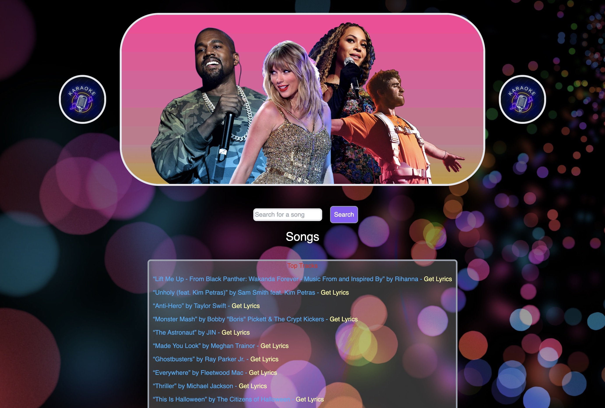

# Karaoke Finder

[Karaoke Finder](https://areas-boot-camp.github.io/karaoke/) is a music web application that gives karaoke lovers a way to search for the lyrics to their favorite songs.

We were motivated to build a simple search form that would let anyone who is about to sing their favorite song a way to prepare for their turn on the mic. This isn’t meant to replace a karaoke machine. Instead, it’s an easier way to find lyrics (better than googling and navigating multiple sites that might be bombarded with ads and spyware).

Our team learned a lot about how to use APIs to get and display data, and also how to display that data beautifully to the user.

<!-- commenting out. I think this is more relevant for the presentation?
## User Story

AS A music lover / enthusiast

I WANT an app where I can listen and view the song lyrics 

SO THAT I can sing along with with the correct lyrics

## Acceptance Criteria

Application allow users to enter and search the name of the song

Application allow users to view the song lyrics

Application allow users to listen to the song
-->

## Technology Used

Languages:
- HTML
- CSS
- JavaScript

Frameworks and APIs:
- [Tailwind](https://tailwindcss.com)
- [Musixmatch Lyrics](https://developer.musixmatch.com/documentation):
  - [chart.tracks.get](https://developer.musixmatch.com/documentation/api-reference/track-chart-get)
  - [track.search](https://developer.musixmatch.com/documentation/api-reference/track-search)
  - [track.lyrics.get](https://developer.musixmatch.com/documentation/api-reference/track-lyrics-get)

## Credits

- [UC Berkeley Extension Coding Bootcamp](https://extension.berkeley.edu/search/publicCourseSearchDetails.do?method=load&courseId=32030644)
- [Karaoke Logo](https://stock.adobe.com/hu/search/images?k=karaoke+logo&asset_id=469607733)
- [Wallpaper](https://www.wallpaperflare.com/static/616/940/840/glare-circles-colorful-bright-wallpaper.jpg)
- [“Pusscat, Pussycat” Nursery Rhyme](https://www.nurseryrhymes.org/pussycat-pussycat.html)

## License

See [LICENSE](./LICENSE).
